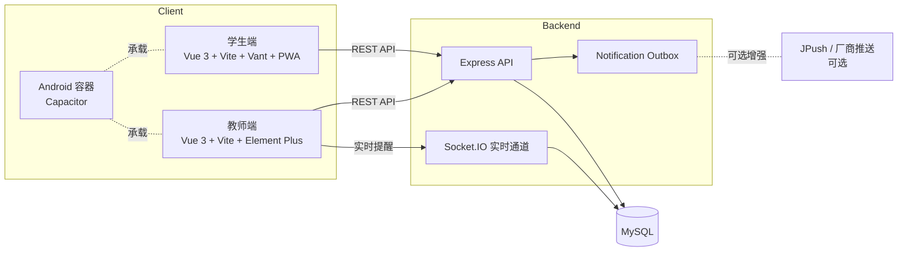
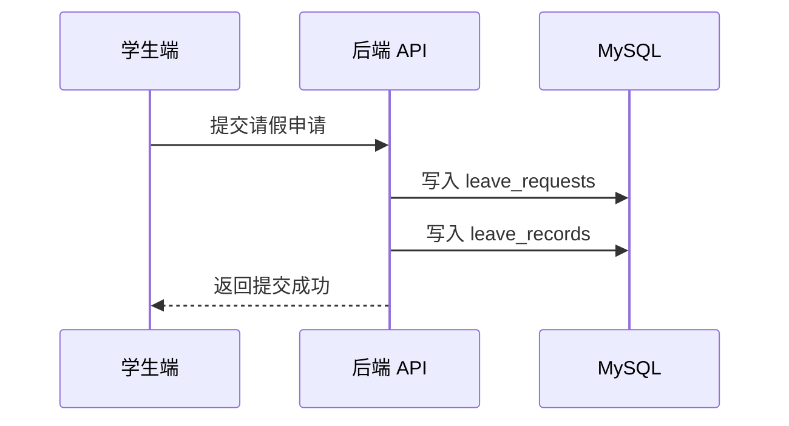
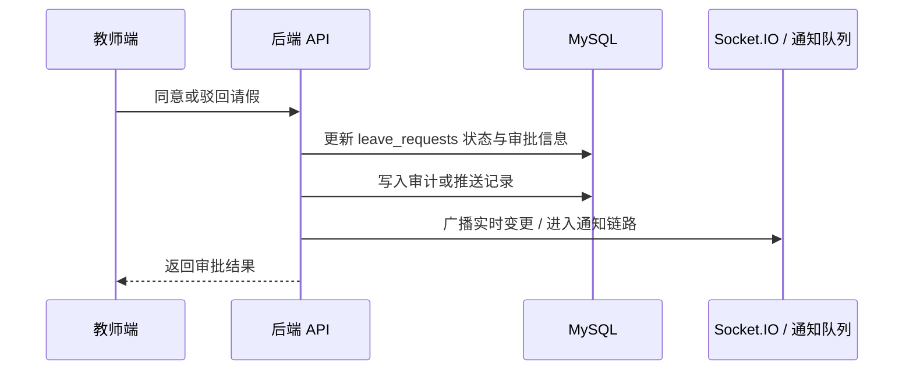

# 架构说明

本文概述项目的系统分层、通信关系、主要数据流和核心表结构，便于快速理解整体实现。

## 系统总览



## 组件职责

### 学生端

- 学生登录与班级码进入
- 请假申请、历史记录和课表查看
- 班干课堂核对与管理辅助入口
- 支持 Web / PWA，保留 Android 容器

### 教师端

- 请假审批
- 今日统计、总览统计、记录日志
- 学生管理、课表管理、数据导出
- 支持 Web，保留 Android 容器和可选推送接入

### 后端

- 提供鉴权、学生端、教师端、统计、审计和备份接口
- 负责 MySQL 数据持久化
- 通过 Socket.IO 向教师端分发实时提醒
- 通过通知队列衔接可选的 Android 远程推送链路

## 通信关系

### 学生端与后端

- 使用 REST API 处理班级码登录、身份校验、请假申请、请假历史和课表查询
- 本地开发通过 Vite 代理转发到 `http://localhost:3000`

### 教师端与后端

- 使用 REST API 处理教师登录、审批、统计、日志、学生管理、课表管理和备份导出
- 通过 `Socket.IO` 接收审批相关的实时提醒和状态更新

### Android / 推送能力

- `Capacitor` 负责将学生端和教师端打包到 Android 容器
- 教师端保留 JPush / 厂商推送接入代码
- 远程推送属于开源版可选能力，不是默认运行依赖

## 关键业务数据流

### 1. 学生提交请假



### 2. 教师审批请假



### 3. 今日统计与总览统计

- 后端从 `leave_requests`、`leave_records`、`classroom_check_submissions` 以及宿舍、课表相关表聚合数据
- 教师端基于聚合结果生成卡片、图表和排行信息
- 统计结果用于日常管理和数据查看

## 数据库主要表关系

下面的 ER 图展示主要业务链路涉及的核心表关系。

```mermaid
erDiagram
    Class ||--o{ Student : contains
    Class ||--o{ Teacher : assigns
    Class ||--o{ Dormitory : owns
    Class ||--o{ Schedule : arranges
    Class ||--o{ SchedulePeriod : defines
    Class ||--o{ ClassSpecialDate : customizes
    Class ||--o{ LeaveRequest : receives
    Class ||--o{ LeaveHistoryArchive : archives

    Dormitory ||--o{ Student : houses

    Student ||--o{ LeaveRequest : submits
    Student ||--o{ LeaveHistoryArchive : owns

    Teacher ||--o{ LeaveRequest : reviews
    Teacher ||--o{ PushDevice : registers
    Teacher ||--o{ PushDelivery : receives

    LeaveRequest ||--o{ LeaveRecord : expands
    Schedule ||--o{ LeaveRecord : maps
```

主表说明：

| 表 | 作用 |
| --- | --- |
| `classes` | 班级与全局班级配置 |
| `students` | 学生基础资料、登录状态与角色 |
| `teachers` | 教师账号与所属班级 |
| `dormitories` | 宿舍分组，用于今日统计与宿舍视图 |
| `schedules` | 班级课程安排 |
| `schedule_periods` | 节次时间定义 |
| `class_special_dates` | 特殊日期与课程调整 |
| `leave_requests` | 请假申请主表 |
| `leave_records` | 请假命中的课程明细 |
| `leave_history_archives` | 历史归档记录 |
| `push_devices` | 教师端推送设备注册信息 |
| `push_deliveries` | 推送投递记录 |
| `notification_outbox` | 后端通知出站队列表 |

补充表说明：

- `audit_logs`：审计日志
- `student_login_logs`：学生登录日志
- `classroom_check_submissions`：课堂核对提交记录

## 开源版边界

- 默认主链路包括学生申请、教师审批、统计查询、日志筛选和本地演示库初始化
- Android 容器可以构建，能否直接运行取决于本机 Android Studio / SDK 环境
- 远程推送仅保留接入点，不作为默认必测项
- 仓库不包含生产证书、私有备份、私有厂商 SDK 和密钥
